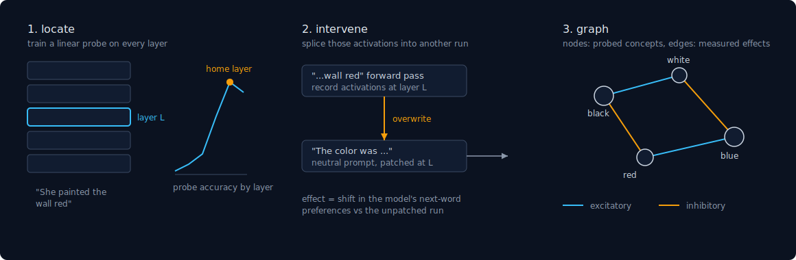
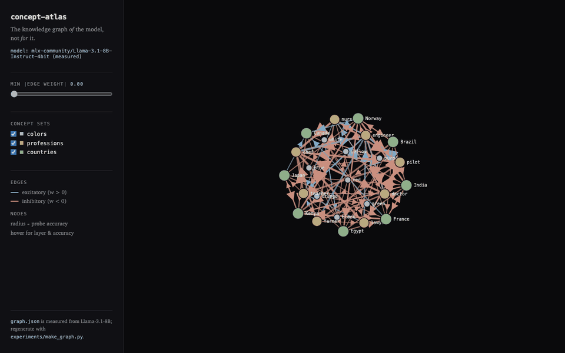

# concept-atlas


concept-atlas measures where a transformer represents a concept, then tests
whether that location actually influences the model's output. The result is
a graph: nodes are concepts placed by probes, edges are measured effects,
rendered in a small web explorer.

## Why I built it

Probing work often stops at correlation: a classifier can read a concept
out of layer 12, so the concept "lives" there. That inference is weaker
than it sounds, because a readable signal is not necessarily a used signal.
The check I wanted is interventional: overwrite the activations at that
location and see whether the model's output moves. This repo automates both
steps and keeps every number rerunnable.

## Method



1. **Locate.** Prompts built from templates ("She painted the wall {}") run
   through the model. A linear classifier is trained on the activations at
   each layer; the layer with peak validation accuracy is the concept's
   home layer.
2. **Intervene.** Run a neutral prompt, but overwrite the activations at
   the home layer with ones recorded from a concept prompt, and measure the
   shift in the model's next-word preferences relative to the unpatched
   run. Positive shift toward a concept is an excitatory edge, negative is
   inhibitory.
3. **Graph.** Nodes carry home layer and probe accuracy, edges carry
   effects. The shipped explorer graph is generated from the Llama runs,
   not written by hand.

One command per model runs the pipeline:

```bash
python -m src.extract --backend torch --model gpt2 --concepts colors
python -m src.extract --backend mlx \
    --model mlx-community/Llama-3.1-8B-Instruct-4bit --concepts colors
```

Models plug in through a small backend interface. PyTorch models use
forward hooks. MLX has no hook API, so the MLX backend temporarily wraps
entries of the model's layer list, which is enough to both record and
overwrite a layer's output. Activations are written to disk in chunks, so
memory use does not grow with the corpus.

## Results

gpt2 and Llama-3.1-8B (4-bit), 96 prompts per concept set, accuracies
averaged over 3 seeds, chance 0.125. Full tables, figures, and raw JSON in
[experiments/results.md](experiments/results.md).

| concept set | gpt2 peak accuracy (layer) | Llama-8B peak accuracy (layer) |
|---|---|---|
| colors | 0.81 (L0) | 0.61 (L29) |
| professions | 0.95 (L11) | 0.86 (L29) |
| countries | 0.91 (L11) | 0.93 (L24) |


Patching has a built-in sanity check: injecting a concept's own activations
into the neutral prompt should strongly boost that concept. It does, on
both models (median self-effect +4.6 on gpt2, +5.3 on Llama), while
cross-concept effects are an order of magnitude smaller. One regularity
showed up on both models without being sought: black and white excite each
other and both suppress the chromatic colors.

## Explorer

```bash
uvicorn src.api:app   # http://127.0.0.1:8000
```



Node size is probe accuracy, edge width is effect size. Hovering a node
shows the measurements behind it.

## Tests

```bash
pip install -e ".[dev]"   # add .[mlx] for quantized models
pytest                    # 46 tests on toy models, no downloads
```

## Caveats

- High probe accuracy shows a concept is linearly readable at a layer; low
  accuracy does not prove absence.
- Effects are estimates under this prompt distribution, not constants of
  the model.
- The early-layer peak for colors on gpt2 likely reflects surface token
  identity rather than abstraction. Capture happens at the final prompt
  token; this is discussed in the results.
