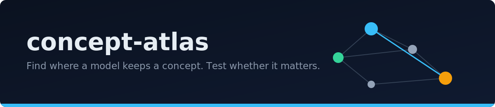

<p align="center"></p>

<p align="center">
  
</p>

Extract a causal concept graph from a transformer's internals: probes find
where a concept lives, activation patching tests whether that place drives
behavior, and a D3 explorer renders the result.

## Motivation

Language models clearly hold concepts like color or country somewhere in
their layers, but "somewhere" is not an answer. I wanted a tool that pins a
concept to a location and then tests whether that location actually causes
behavior, by swapping activations mid-computation and watching the output
move. Correlation is cheap; intervention is evidence. Every node and edge
in the graph this produces is a rerunnable experiment, not an illustration.

## Results

Measured on gpt2 and Llama-3.1-8B (4-bit, on a MacBook), 96 prompts per
concept set, probe accuracy averaged over 3 seeds. Chance is 0.125. Full
tables, figures, and raw JSON: [experiments/results.md](experiments/results.md).

| concept set | gpt2 peak accuracy (layer) | Llama-8B peak accuracy (layer) |
|---|---|---|
| colors | 0.81 (L0) | 0.61 (L29) |
| professions | 0.95 (L11) | 0.86 (L29) |
| countries | 0.91 (L11) | **0.93 (L24)** |

<p align="center"></p>

Patching passes its built-in sanity check on both models: injecting a
concept's own activations into a neutral prompt strongly boosts that
concept (median effect +4.6 on gpt2, +5.3 on Llama) while cross-concept
effects are an order of magnitude smaller. One regularity replicated across
both models without being sought: black and white excite each other while
both suppress the chromatic colors.

## How it works

Three steps, each a measurement:

1. **Locate.** Prompts from templates ("She painted the wall {}") run
   through the model; a linear classifier is trained on the internal
   activations at every layer. The layer where accuracy peaks is the
   concept's home.
2. **Intervene.** Run a neutral prompt, but splice in the activations
   recorded from a concept prompt at that layer, and measure how much the
   model's next-word preferences move. Positive effect: excitatory edge.
   Negative: inhibitory.
3. **Render.** Nodes carry home layer and probe accuracy; edges carry
   measured effects. The shipped graph is generated from the Llama runs,
   not hand-made.

The whole pipeline is one command per model:

```bash
python -m src.extract --backend torch --model gpt2 --concepts colors
python -m src.extract --backend mlx \
    --model mlx-community/Llama-3.1-8B-Instruct-4bit --concepts colors
```

Models plug in through a small backend interface: PyTorch models use
forward hooks; quantized models run through MLX, where hooks do not exist,
so the backend wraps the model's layer list instead. Activations stream to
disk in chunks, so memory stays flat regardless of corpus size.

## The explorer

```bash
uvicorn src.api:app   # then open http://127.0.0.1:8000
```

<p align="center"></p>

Node size is probe accuracy, edge width is effect size, blue excites, red
inhibits. Filter by effect strength or concept set; hover for the measured
numbers behind any node.

## Run it

```bash
pip install -e ".[dev]"    # add .[mlx] for quantized models
pytest                     # 46 tests, toy models, no downloads, under a second
```

## Caveats

- High probe accuracy shows information is linearly present; low accuracy
  does not prove absence.
- Effects are measured under this prompt distribution; they are estimates
  of influence there, not universal constants.
- Early-layer accuracy peaks (colors on gpt2) likely reflect surface token
  identity rather than abstraction; stated in the results, not smoothed over.
