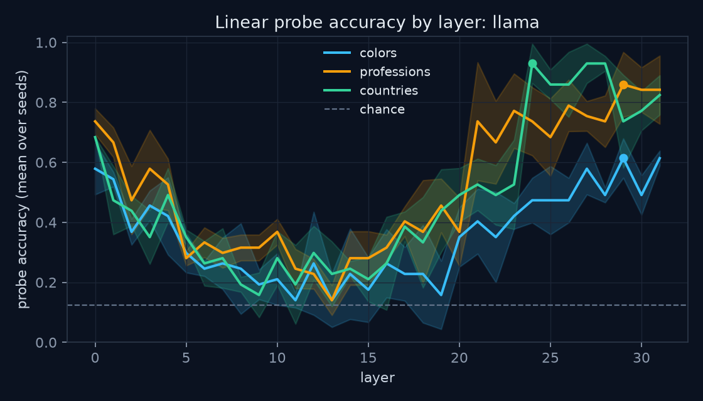

# concept-atlas

**The knowledge graph *of* the model, not *for* it.**

`concept-atlas` extracts a causal concept graph from a transformer's internals.
Given a small Hugging Face model (default: `gpt2`) and a seed set of concepts
(colors, professions, countries, …), it:

1. **Locates** each concept with linear probes trained on residual-stream
   activations, layer by layer;
2. **Tests causal links** between concept pairs with activation patching —
   swapping one concept's activations into another's forward pass and measuring
   the effect;
3. **Emits** a typed, weighted knowledge graph: concepts as nodes,
   causal influence as edges, exported as JSON and rendered in a D3 explorer.

Most knowledge graphs are built *for* models to consume. This one is read
*out of* the model: every node is a probe result, every edge is a measured
intervention, and every claim in the graph is falsifiable by re-running the
experiment that produced it.

## Quickstart

```bash
git clone <your-fork-url> concept-atlas && cd concept-atlas
python3 -m venv .venv && source .venv/bin/activate
pip install -e ".[dev]"

# run the test suite
pytest

# launch the API + explorer (demo graph included)
uvicorn src.api:app --reload
# then open http://127.0.0.1:8000
```

`gpt2` is public — no Hugging Face token is required. For gated models, put
`HF_TOKEN=...` in `.env` (gitignored, see `.env.example`) and export it, or run
`huggingface-cli login`.

## How it works

### 1. Probing (`src/probes.py`, `src/hooks.py`)

`ResidualCache` registers forward hooks on every transformer block and records
the residual stream. For each concept set, prompts are built from templates
(`concepts/*.json`), activations are collected at the last token, and a linear
probe is trained per layer:

```python
import torch
from transformers import AutoModelForCausalLM, AutoTokenizer
from src.hooks import ResidualCache
from src.probes import sweep_layers

model = AutoModelForCausalLM.from_pretrained("gpt2")
tok = AutoTokenizer.from_pretrained("gpt2")

ids = tok(["The sky at dusk is purple", "The sky at dusk is orange"],
          return_tensors="pt", padding=True).input_ids
with ResidualCache(model) as cache:
    model(ids)

acts = {layer: h[:, -1, :] for layer, h in cache.activations.items()}
reports = sweep_layers(acts, labels=torch.tensor([0, 1]))
```

The layer with peak probe accuracy is taken as the concept's *home layer* —
where the model most linearly represents it.

### Scaling: backends and the activation cache

Everything downstream of a model consumes plain numpy arrays through a small
backend interface (`src/backends.py`), so probing and graph code never touch
framework specifics:

- **`TorchBackend`** wraps any Hugging Face causal LM with forward hooks,
  with attention-mask-correct last-token capture under padding.
- **`MlxBackend`** runs 4-bit quantized models through `mlx_lm`
  (`pip install -e ".[mlx]"`). MLX has no hook API, so the backend temporarily
  swaps entries of the model's layer list for taps that record or replace a
  block's output. Same two capabilities as hooks, quantized weights, and
  Llama-3.1-8B fits comfortably on a laptop.

Activations are collected in prompt chunks and appended to per-layer
memory-mapped arrays on disk (`src/activation_store.py`; runs land under
`activations/`, gitignored), so peak RAM stays at one chunk regardless of
corpus size. The whole pipeline is one command:

```bash
python -m src.extract --backend torch --model gpt2 --concepts colors
python -m src.extract --backend mlx \
    --model mlx-community/Llama-3.1-8B-Instruct-4bit --concepts colors
```

Each run directory carries provenance (`meta.json`), the cached layers,
labels, and the per-layer probe report (`probes.json`). A backend-agnostic
`causal_effect` lives in `src/backends.py`; when base and source prompts
tokenize to different lengths, patches are tail-aligned, since concept
templates differ near the end and metrics read the final position.

### 2. Patching (`src/patching.py`)

For a candidate edge A → B, we run the model on a base prompt, patch in the
residual-stream activations from a source prompt at A's home layer, and measure
the change in a metric for B (e.g. logit difference over B's token set):

```python
from src.patching import causal_effect, logit_diff_metric

effect = causal_effect(
    model,
    base_ids=base, source_ids=source,
    layer=6,
    metric=logit_diff_metric(target_ids=b_tokens),
)
```

A large |effect| means the information written at that layer causally moves the
model's belief about B — not merely correlates with it.

### 3. Graph extraction (`src/graph.py`)

Nodes carry `(concept, set, home layer, probe accuracy)`; edges carry
`(weight, kind, layer)` where `kind` is `excitatory` or `inhibitory` by the
sign of the measured effect. The graph prunes below a weight threshold and
serializes to the D3 format consumed by the explorer:

```python
from src.graph import ConceptGraph, ConceptNode

g = ConceptGraph(model_name="gpt2")
g.add_node(ConceptNode(id="red", name="red", group="colors", layer=6, accuracy=0.94))
g.add_edge("red", "blue", weight=-0.31, layer=6)
g.prune(min_weight=0.05)
g.save("static/graph.json")
```

## Results

Reproducible runs on gpt2 and Llama-3.1-8B (4-bit MLX) live in
[experiments/](experiments/), with figures, tables, and raw JSON in
[experiments/results.md](experiments/results.md). Headlines, measured on an
M5 MacBook (chance is 0.125 everywhere):

| concept set | gpt2 peak acc (layer) | Llama-3.1-8B peak acc (layer) |
|---|---|---|
| colors | 0.81 (L0) | 0.61 (L29) |
| professions | 0.95 (L11) | 0.86 (L29) |
| countries | 0.91 (L11) | 0.93 (L24) |



Patching passes its built-in sanity check on both models: patching an item's
own activations into a neutral prompt strongly boosts that item (diagonal
median +4.6 on gpt2, +5.3 on Llama) while cross-item effects are an order of
magnitude smaller and mostly inhibitory. One structural regularity replicates
across both models: black and white excite each other while suppressing the
chromatic colors.

## The explorer (`static/`)

A single-page D3 force graph, dark scientific aesthetic, no build step:

- node radius ∝ probe accuracy, color by concept set
- edge width ∝ |weight|; excitatory and inhibitory edges are visually distinct
- filter by minimum edge weight and by concept set
- hover for probe details (home layer, accuracy, effect sizes)

It ships with a demo graph (`static/graph.json`) so the UI is inspectable
before you run any extraction.

## Project layout

```
src/
  hooks.py             # residual-stream capture + activation patching hooks (torch)
  backends.py          # model-agnostic capture/patch interface: torch + MLX backends
  activation_store.py  # chunked on-disk activation cache (per-layer memmaps)
  extract.py           # CLI: concept set -> cached activations -> probe sweep
  probes.py            # linear probes, per-layer sweep, accuracy reports
  patching.py          # causal-effect measurement between concept pairs
  graph.py             # typed weighted graph, pruning, JSON (D3) export
  api.py               # FastAPI app: /api/* endpoints + static explorer
tests/          # pytest suite (runs on toy models; no downloads)
static/         # D3 explorer (index.html, app.js, style.css, graph.json)
concepts/       # seed concept sets (colors, professions, countries)
```

## Concept set format

```json
{
  "name": "colors",
  "items": ["red", "orange", "yellow", "green", "blue", "purple", "black", "white"],
  "templates": [
    "The color of the object was {}.",
    "She painted the wall {}.",
    "The {} car parked outside."
  ]
}
```

Templates are filled with each item to build probe/patching prompts; multiple
templates reduce prompt-specific artifacts.

## Design notes & caveats

- **Linear probes are a lower bound.** High probe accuracy shows information is
  linearly present; low accuracy does not prove absence.
- **Patching effects are prompt-relative.** Edge weights depend on the prompt
  distribution in `concepts/`; they are estimates of influence under that
  distribution, not universal constants.
- **Toy-model tests.** The suite exercises hooks, probes, patching, graph, and
  API against a small synthetic transformer, so `pytest` is fast and
  deterministic and requires no model downloads.

## Status

See [ROADMAP.md](ROADMAP.md). M1 (probing) and M2 (patching + graph export)
have working library implementations; M3 (explorer) ships with demo data;
M4 (model diffing) is planned.

## License

MIT — see [LICENSE](LICENSE).
