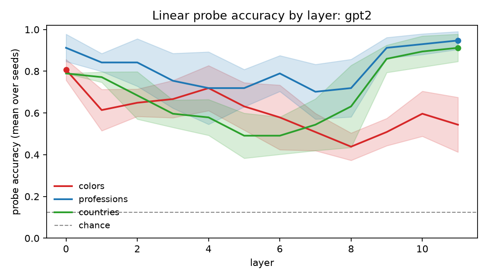
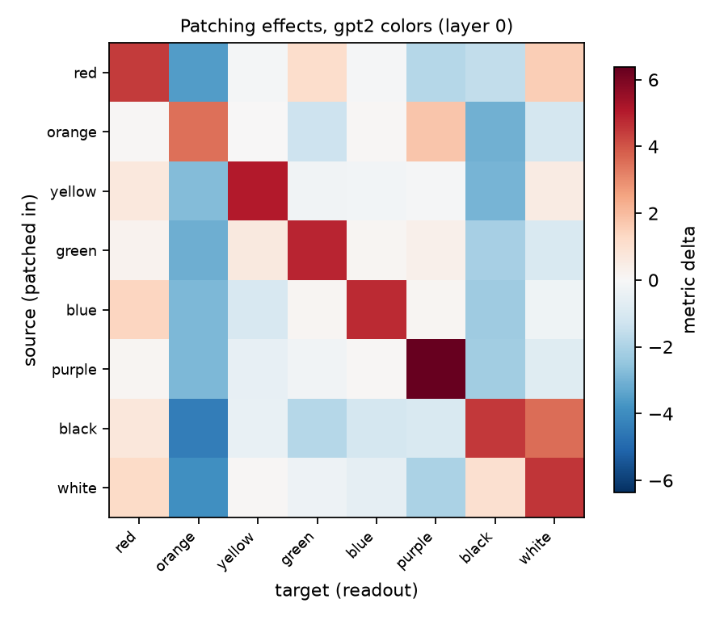
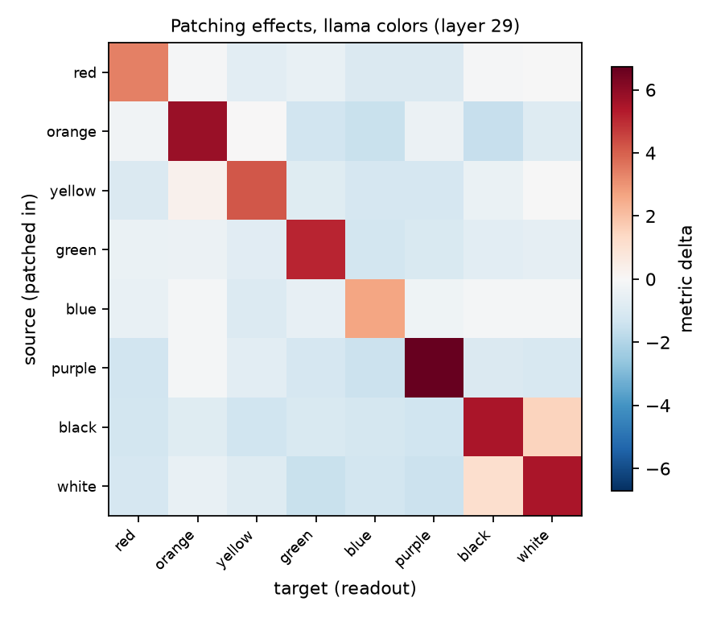

# Results

Reproduce with `run_probes` and `run_patching` for each model; raw JSON lives beside this file in `results/`.

## Probe accuracy by layer

### gpt2 (gpt2, 12 layers)

| concept set | prompts | home layer | peak accuracy | chance |
|---|---|---|---|---|
| colors | 96 | 0 | 0.807 (std 0.050) | 0.125 |
| professions | 96 | 11 | 0.947 (std 0.043) | 0.125 |
| countries | 96 | 11 | 0.912 (std 0.066) | 0.125 |

### llama (mlx-community/Llama-3.1-8B-Instruct-4bit, 32 layers)

| concept set | prompts | home layer | peak accuracy | chance |
|---|---|---|---|---|
| colors | 96 | 29 | 0.614 (std 0.066) | 0.125 |
| professions | 96 | 29 | 0.860 (std 0.108) | 0.125 |
| countries | 96 | 24 | 0.930 (std 0.066) | 0.125 |

## Activation patching

### gpt2: colors at layer 0

Base prompt `The color of the object was`; source activations patched tail-aligned at layer 0. Diagonal median +4.632; off-diagonal median absolute effect 0.976.

| source | target | effect |
|---|---|---|
| black | orange | -4.398 |
| white | orange | -3.918 |
| black | white | +3.552 |
| red | orange | -3.551 |
| green | orange | -3.086 |
| orange | black | -3.042 |
| yellow | black | -2.981 |
| blue | orange | -2.864 |
| purple | orange | -2.845 |
| yellow | orange | -2.775 |

### llama: colors at layer 29

Base prompt `The color of the object was`; source activations patched tail-aligned at layer 29. Diagonal median +5.320; off-diagonal median absolute effect 0.854.

| source | target | effect |
|---|---|---|
| orange | black | -1.542 |
| black | white | +1.519 |
| orange | blue | -1.493 |
| white | green | -1.478 |
| white | purple | -1.458 |
| purple | blue | -1.423 |
| black | purple | -1.359 |
| black | yellow | -1.347 |
| orange | green | -1.306 |
| purple | red | -1.298 |

## Notes

- Probes: logistic regression on last-token residual stream, 80/20 train/val split, mean over 3 seeds; shaded bands are the seed spread.
- Patching: one patched forward per source item; every target is a logit readout of the same forward. Effects are deltas against the unpatched base prompt.
- Capture position is the prompt's final token while templates place the item at varied positions, so early-layer peaks (colors on gpt2) likely reflect surface token identity rather than abstraction; late-layer peaks are the more meaningful signal.
- Small-scale by design: 96 prompts per concept set on a laptop. Directionally useful, not a substitute for large-sample studies.
